# Complete Web Request Lifecycle: Browser → Internet → AWS → Application → Database → Browser

A production-engineering view of what happens when a user types:

`https://www.example.com`

into a browser and presses Enter.

This guide explains the system as it actually works in production: DNS, networking, TLS, CDN, WAF, load balancers, AWS networking, reverse proxy, Ruby on Rails, Redis, databases, object storage, background jobs, and the final browser render.

This is not just a list of technologies. It is a systems view of data flow.

Table of Contents

- [1. Executive Summary](#1-executive-summary)
- [2. URL Anatomy](#2-url-anatomy)
- [3. Browser Side: What The Browser Does Before Sending the Request](#3-browser-side-what-the-browser-does-before-sending-the-request)
- [4. DNS: Domain Name to IP Address](#4-dns-domain-name-to-ip-address)
- [5. Internet and Network Fundamentals](#5-internet-and-network-fundamentals)
- [6. TCP: Reliable Connection](#6-tcp-reliable-connection)
- [7. TLS / HTTPS: Secure Transport](#7-tls--https-secure-transport)
- [8. HTTP Request and Response](#8-http-request-and-response)
- [9. CDN and Edge Caching](#9-cdn-and-edge-caching)
- [10. WAF and Edge Security](#10-waf-and-edge-security)
- [11. AWS Networking and Load Balancing](#11-aws-networking-and-load-balancing)
- [12. Nginx + Puma + Ruby on Rails](#12-nginx--puma--ruby-on-rails)
- [13. Middleware, Routing, and Controller Flow](#13-middleware-routing-and-controller-flow)
- [14. Redis Caching](#14-redis-caching)
- [15. Database Query Path](#15-database-query-path)
- [16. S3 and File Storage](#16-s3-and-file-storage)
- [17. Background Jobs and Async Work](#17-background-jobs-and-async-work)
- [18. Authentication and Authorization](#18-authentication-and-authorization)
- [19. Full Production Architecture](#19-full-production-architecture)
- [20. Full Request Trace: End-to-End](#20-full-request-trace-end-to-end)
- [21. Response Journey Back to Browser](#21-response-journey-back-to-browser)
- [22. Failure Modes and Recovery](#22-failure-modes-and-recovery)
- [23. Performance and Scaling](#23-performance-and-scaling)
- [24. Observability](#24-observability)
- [25. Final Mental Model](#25-final-mental-model)
- [26. Glossary](#26-glossary)

---

# 1. Executive Summary

When a user types `https://www.example.com` and presses Enter, the browser does not connect directly to the application server in one step.

The request travels through multiple layers:

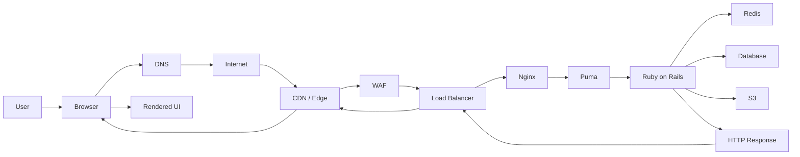

The real request path is:

Browser → DNS → Internet → CDN → WAF → Load Balancer → Nginx → Puma → Rails → Redis / DB / S3 → Response → Browser → React/UI

This is the production view of a modern web application.

---

# 2. URL Anatomy

Consider this URL:

`https://www.example.com:443/products/123?sort=price#reviews`

```mermaid
flowchart LR
    URL[https://www.example.com:443/products/123?sort=price#reviews]
    URL --> SCHEME[https]
    URL --> HOST[www.example.com]
    URL --> PORT[443]
    URL --> PATH[/products/123]
    URL --> QUERY[sort=price]
    URL --> FRAG[reviews]
```

## 2.1 Parts

- `https`: protocol
- `www`: subdomain
- `example.com`: domain
- `.com`: top-level domain
- `:443`: port
- `/products/123`: path
- `?sort=price`: query string
- `#reviews`: fragment

## 2.2 Why this matters

The browser uses each part differently:

- protocol decides whether to use HTTPS
- host determines the server
- port identifies the service
- path identifies the resource
- query params give search or filter data
- fragment is purely client-side navigation

---

# 3. Browser Side: What The Browser Does Before Sending the Request

The browser is the first layer in the system.

## 3.1 Browser steps

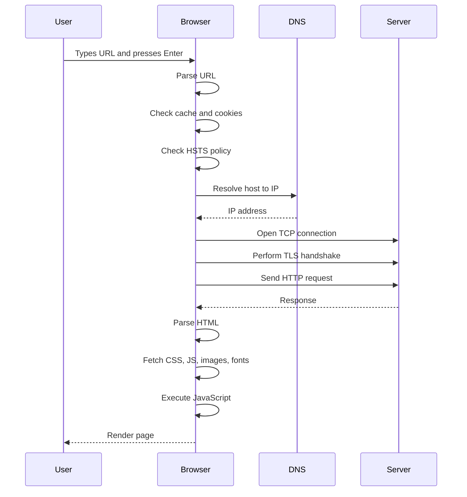

## 3.2 Key browser features

### Browser cache
Helps avoid fetching the same files repeatedly.

### Cookies
Used for login session and personalization.

### Local Storage / Session Storage
Used by application state and UI state.

### HSTS
HSTS stands for Hypertext Strict Transport Security. It tells the browser to always use HTTPS for that domain.

### Same-Origin Policy
Prevents scripts from one origin from reading another origin’s data unless explicitly allowed.

### CORS
CORS stands for Cross-Origin Resource Sharing. It allows controlled access between origins.

---

# 4. DNS: Domain Name to IP Address

DNS stands for Domain Name System.

It maps human-friendly names like `www.example.com` to machine addresses like `93.184.216.34`.

## 4.1 Resolver flow

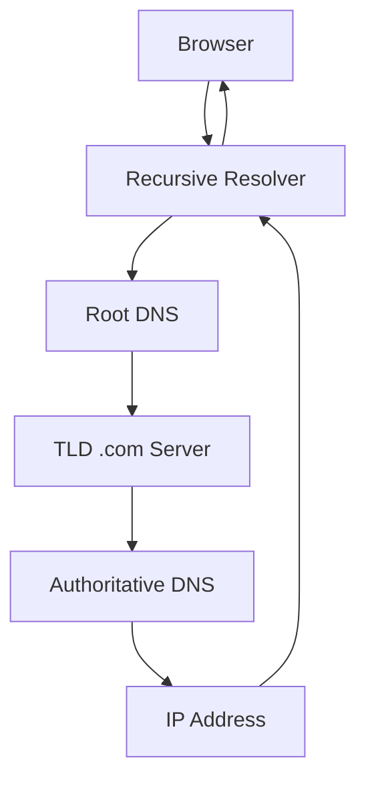

## 4.2 Important terms

### Domain registrar
This is where the domain is registered.
Examples:
- GoDaddy
- Namecheap
- Porkbun

### DNS provider
This serves the actual DNS records.
Examples:
- Route 53
- Cloudflare
- Azure DNS

Important:
- Registrar and DNS provider are not always the same company.

### Recursive resolver
A server that resolves DNS names on behalf of the client.
Examples:
- ISP resolver
- 1.1.1.1
- 8.8.8.8

### Authoritative DNS server
This is the server that has the final answer.

## 4.3 Common DNS records

| Record | Purpose |
|---|---|
| A | Maps hostname to IPv4 |
| AAAA | Maps hostname to IPv6 |
| CNAME | Alias to another hostname |
| MX | Mail records |
| TXT | Metadata, verification |
| NS | Nameserver |
| TTL | Cache lifetime |

## 4.4 Real example

```dns
www.example.com.   IN   A   93.184.216.34
```

The browser receives the IP and can now make a connection.

---

# 5. Internet and Network Fundamentals

The internet is a huge network of routers and ISPs.

## 5.1 Basic network concepts

### IP address
A numeric address used to locate devices.

Examples:
- IPv4: `93.184.216.34`
- IPv6: `2001:db8::1`

### Public IP
Visible on the public internet.

### Private IP
Used inside a private network.

### NAT
NAT stands for Network Address Translation. It lets private networks share a public IP.

### Port
A number that identifies a service on an IP.

Examples:
- 80 = HTTP
- 443 = HTTPS
- 5432 = PostgreSQL
- 6379 = Redis

### Socket
A combination of:
- IP address
- port
- protocol

Example:
`93.184.216.34:443`

## 5.2 Practical network path

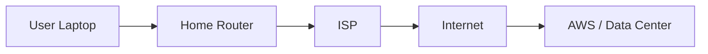

This is the path that the request eventually takes.

---

# 6. TCP: Reliable Connection

TCP stands for Transmission Control Protocol.

It provides reliable, ordered, error-checked delivery.

## 6.1 TCP three-way handshake

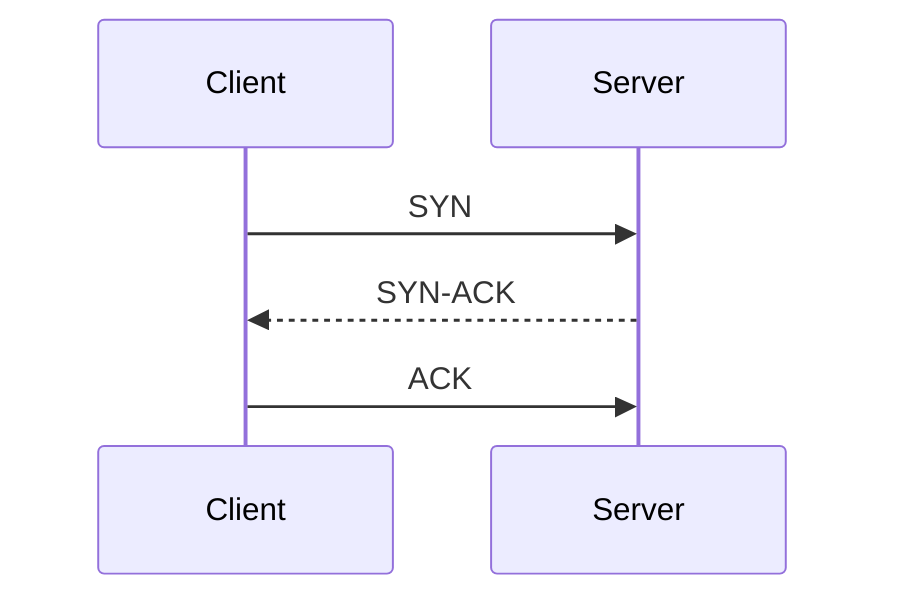

This creates the TCP connection before actual HTTP data is sent.

## 6.2 Why it matters

TCP ensures that data:
- arrives reliably
- arrives in order
- is retransmitted if lost
- can recover from packet loss

This is important for web requests.

---

# 7. TLS / HTTPS: Secure Transport

TLS stands for Transport Layer Security.

HTTPS = HTTP + TLS.

## 7.1 Why HTTPS is required

Without TLS:
- traffic can be read in transit
- malicious actors can modify content
- users can be tricked into trusting fake websites

## 7.2 TLS handshake

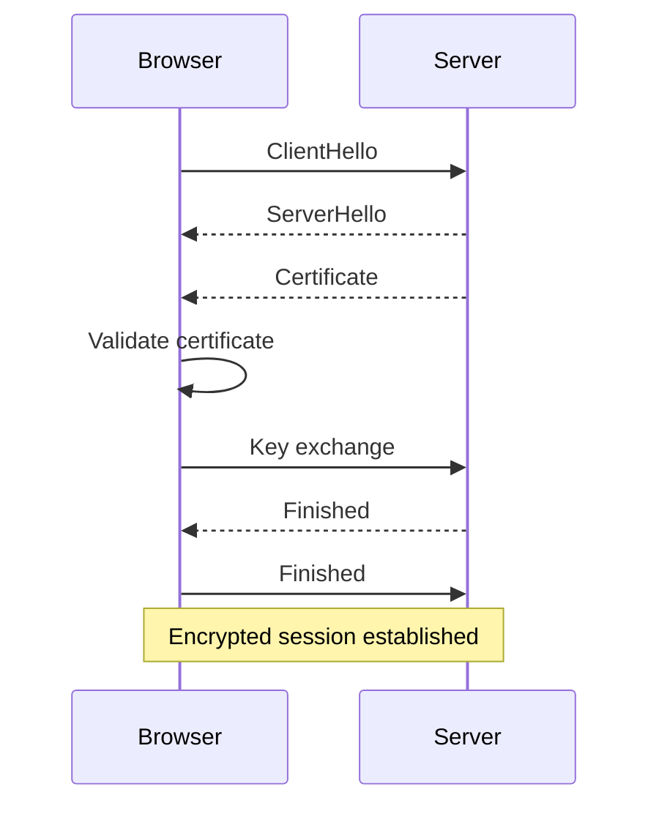

## 7.3 Certificate authority

A certificate is issued by a trusted certificate authority (CA), such as Let’s Encrypt or DigiCert.

The browser validates:
- certificate is valid
- hostname matches
- certificate issuer is trusted

## 7.4 After the handshake

Now the browser sends an encrypted HTTP request.

This protects:
- cookies
- session tokens
- payment data
- user credentials

---

# 8. HTTP Request and Response

HTTP stands for Hypertext Transfer Protocol.

## 8.1 Example request

```http
GET /products/123 HTTP/1.1
Host: www.example.com
User-Agent: Mozilla/5.0
Accept: text/html
Cookie: session_id=abc123
Authorization: Bearer token
```

## 8.2 Example response

```http
HTTP/1.1 200 OK
Content-Type: text/html; charset=UTF-8
Cache-Control: no-cache
Set-Cookie: session_id=xyz; HttpOnly; Secure; SameSite=Lax

<html>...</html>
```

## 8.3 Basic HTTP lifecycle

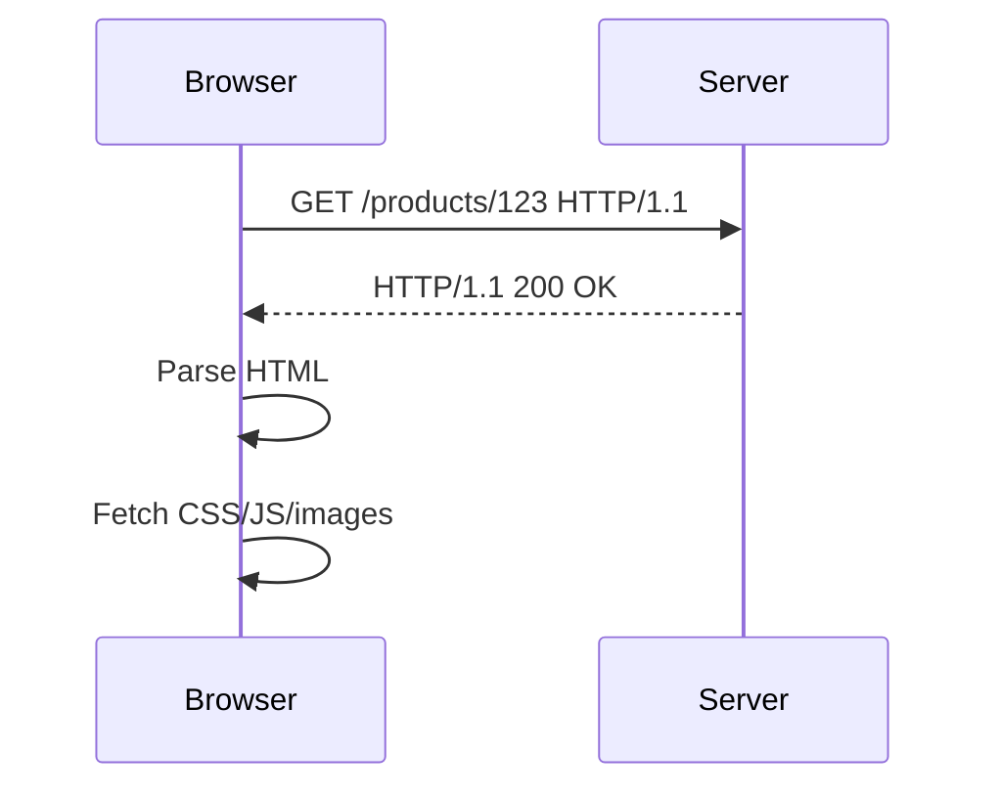

## 8.4 Status codes

| Code | Meaning |
|---|---|
| 200 | OK |
| 201 | Created |
| 204 | No Content |
| 301 | Redirect |
| 302 | Found |
| 400 | Bad Request |
| 401 | Unauthorized |
| 403 | Forbidden |
| 404 | Not Found |
| 429 | Too Many Requests |
| 500 | Internal Server Error |
| 502 | Bad Gateway |
| 503 | Service Unavailable |
| 504 | Gateway Timeout |

---

# 9. CDN and Edge Caching

CDN stands for Content Delivery Network.

A CDN caches content in edge locations near the user.

## 9.1 CDN flow

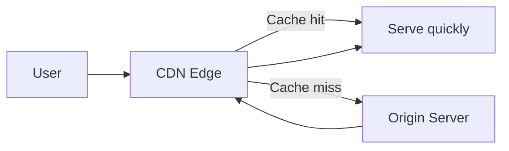

## 9.2 Why CDNs matter

CDNs reduce:
- latency
- origin server load
- bandwidth cost
- DDoS impact

They are especially useful for:
- images
- CSS
- JS bundles
- static HTML
- media files

## 9.3 Edge caching logic

- static asset is cached at the nearest edge
- repeated requests are served from edge
- if cache expires, origin is queried again

---

# 10. WAF and Edge Security

WAF stands for Web Application Firewall.

It sits in front of the app and inspects incoming HTTP traffic.

## 10.1 WAF architecture

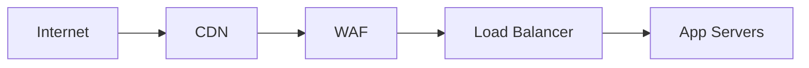

## 10.2 WAF protects against

- SQL injection
- XSS
- bot traffic
- abusive rate patterns
- malicious IPs
- path-based attacks
- brute-force login attempts

## 10.3 Why production systems use WAF

It reduces attack surface before traffic hits the application.

---

# 11. AWS Networking and Load Balancing

This is the production path in AWS.

## 11.1 Production architecture diagram

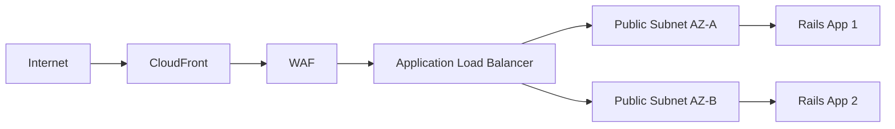

## 11.2 AWS components

### VPC
VPC stands for Virtual Private Cloud. It is the private network boundary in AWS.

### Subnet
A subnet divides the VPC into smaller network blocks.

### Public subnet
Accessible from the internet.

### Private subnet
Not directly exposed to the internet.

### Route table
Tells traffic where to go.

### Internet Gateway
Allows public traffic in and out.

### NAT Gateway
Allows private resources to initiate outbound internet traffic.

## 11.3 Load balancer responsibilities

- distribute requests to multiple app instances
- perform health checks
- terminate TLS
- route traffic by host or path
- improve resiliency

## 11.4 Example target flow

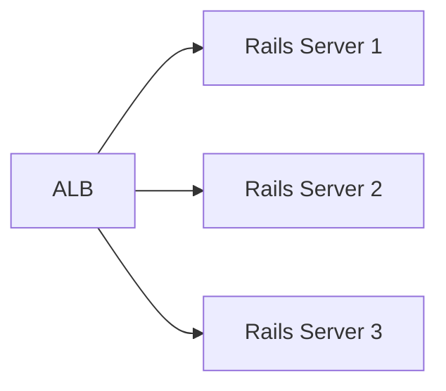

If one app instance fails, traffic is routed away from it.

---

# 12. Nginx + Puma + Ruby on Rails

This is the application layer.

## 12.1 Typical request flow

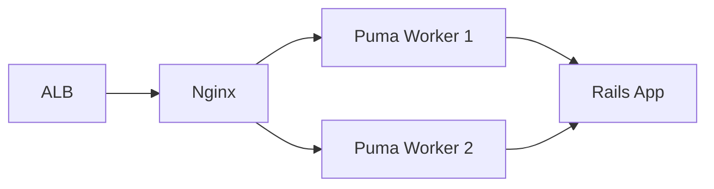

## 12.2 Nginx

Nginx acts as:

- reverse proxy
- static file server
- request router
- TLS terminator
- request buffer

## 12.3 Puma

Puma is the Ruby application server. It runs Rails processes and can handle concurrency efficiently.

## 12.4 Rails

Rails handles:
- route matching
- request parsing
- authentication
- authorization
- business logic
- response generation

---

# 13. Middleware, Routing, and Controller Flow

The application layer does more than just query the database.

## 13.1 Rails request lifecycle

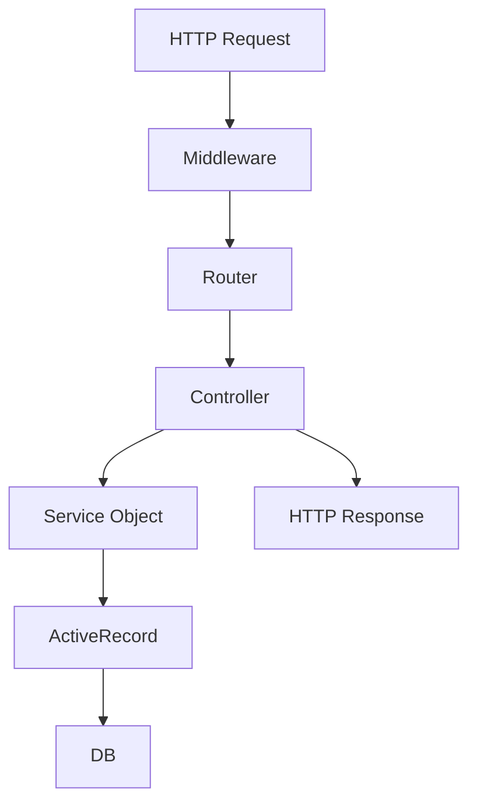

## 13.2 Middleware examples

- request logging
- tracing IDs
- rate limiting
- request validation
- CORS
- auth middleware
- session manager

## 13.3 Router

Example:
```ruby
Rails.application.routes.draw do
  get "/products/:id", to: "products#show"
end
```

This matches:

`/products/123`

## 13.4 Controller

```ruby
class ProductsController < ApplicationController
  def show
    product = Product.find(params[:id])
    render json: product
  end
end
```

## 13.5 Service layer

Complex logic is often moved out of controllers into service objects.

This keeps controllers thin and business logic clearer.

---

# 14. Redis Caching

Redis is in-memory data storage used heavily in production.

## 14.1 Redis flow

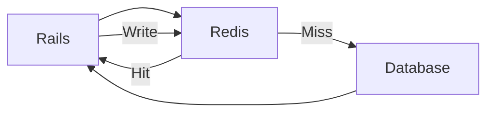

## 14.2 Typical Redis uses

- caching hot reads
- user session storage
- rate limiting counters
- job queue backend
- distributed locks
- transient data

## 14.3 Why Redis matters

Redis helps avoid expensive database calls for frequently accessed data.

This reduces latency and database load.

---

# 15. Database Query Path

The database is where data is stored durably.

## 15.1 Database architecture

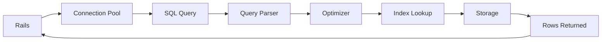

## 15.2 SQL example

```sql
SELECT *
FROM products
WHERE id = 123
LIMIT 1;
```

This is the database path for a product lookup.

## 15.3 Important database concepts

- transaction
- primary key
- foreign key
- index
- join
- lock
- read replica
- failover
- connection pooling

## 15.4 Why this matters in production

Slow database queries often become the real bottleneck.

A system can look healthy at the network layer and still be slow because of:
- missing indexes
- lock contention
- DB CPU saturation
- slow queries
- connection pool exhaustion

---

# 16. S3 and File Storage

S3 stands for Simple Storage Service.

It is used for:
- object storage
- files
- uploaded user content
- static assets
- backups
- media files

## 16.1 S3 flow

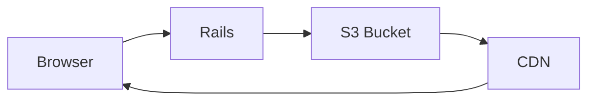

## 16.2 Direct upload pattern

Often the app generates a presigned URL so the browser uploads directly to S3.

Benefits:
- reduces app server load
- better scaling for large file uploads
- simpler file handling

---

# 17. Background Jobs and Async Work

Not every request should be processed synchronously.

## 17.1 Background job flow

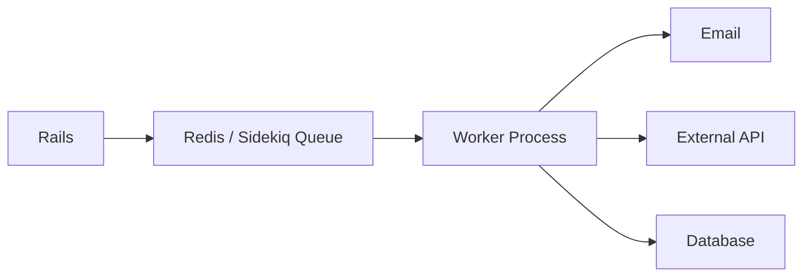

## 17.2 Typical background work

- sending emails
- generating reports
- processing image uploads
- syncing external systems
- queueing notifications

This keeps user-facing requests fast.

---

# 18. Authentication and Authorization

## 18.1 Authentication

Authentication answers: “Who is this user?”

Examples:
- cookie session
- JWT
- OIDC / OAuth
- API key

## 18.2 Authorization

Authorization answers: “What is this user allowed to do?”

Examples:
- admin vs normal user
- manager vs employee
- only owner can edit a record

## 18.3 Authentication flow

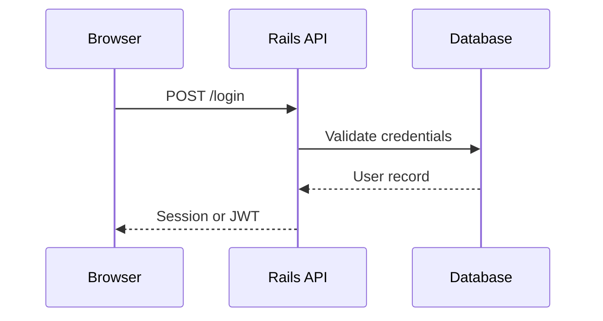

## 18.4 Security attributes

Typical secure cookie settings:
- `HttpOnly`
- `Secure`
- `SameSite`

These reduce:
- XSS attacks
- CSRF attacks
- credential theft

---

# 19. Full Production Architecture

This is a realistic production architecture.

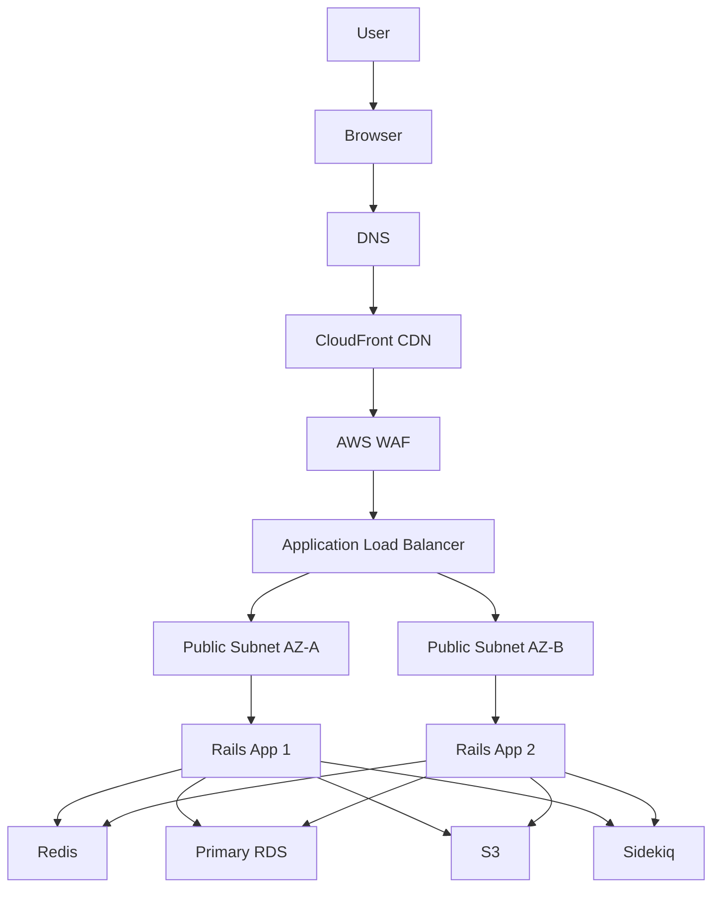

Production concerns:
- multiple app instances
- private DB subnet
- private Redis
- security groups
- CDN for edge acceleration
- WAF for edge filtering
- load balancer for traffic distribution
- background workers for async work

---

# 20. Full Request Trace: End-to-End

Let’s follow an actual request:

`GET https://www.example.com/api/v1/orders/123`

```mermaid
sequenceDiagram
    participant U as User
    participant B as Browser
    participant DNS as DNS
    participant CDN as CloudFront
    participant WAF as WAF
    participant ALB as ALB
    participant N as Nginx
    participant P as Puma
    participant R as Rails
    participant REDIS as Redis
    participant DB as Postgres
    participant S3 as S3

    U->>B: Visit URL
    B->>DNS: Lookup IP
    DNS-->>B: 93.184.216.34
    B->>CDN: HTTPS request
    CDN->>WAF: Inspect request
    WAF->>ALB: Pass request
    ALB->>N: Route to app
    N->>P: Proxy request
    P->>R: App request
    R->>REDIS: Cache lookup
    REDIS-->>R: Cache miss
    R->>DB: Query order 123
    DB-->>R: Row data
    R->>S3: Maybe fetch attachment or image
    S3-->>R: File if needed
    R-->>P: JSON response
    P-->>N: Response
    N-->>ALB: Response
    ALB-->>WAF: Response
    WAF-->>CDN: Response
    CDN-->>B: Response
    B-->>U: Render page
```

This is the important production mental model.

---

# 21. Response Journey Back to Browser

The server response follows the reverse path.

```mermaid
flowchart LR
    DB[Database] --> RAILS[Rails]
    RAILS --> PUMA[Puma]
    PUMA --> NGINX[Nginx]
    NGINX --> ALB[Load Balancer]
    ALB --> WAF[WAF]
    WAF --> CDN[CDN]
    CDN --> BROWSER[Browser]
    BROWSER --> REACT[React / UI]
    REACT --> USER[User]
```

Important production point:
- the response is not just HTML
- may include JSON, JS bundles, CSS, images, and API data
- browser then executes JS and renders the app

---

# 22. Failure Modes and Recovery

Production systems fail in predictable ways.

## 22.1 Common failures

### DNS outage
The site cannot be resolved.

### TLS certificate problem
Browser rejects the connection.

### WAF block
Malicious or abusive request is denied.

### ALB unhealthy
No healthy app nodes.

### Database slow or down
App becomes slow or fails.

### Redis unavailable
Cache misses increase, app slows down.

### S3 outage
Media files fail to load.

### AZ failure
Multi-AZ design matters.

## 22.2 Recovery patterns

- health checks
- failover
- active-active or active-passive deployment
- read replicas
- autoscaling
- CI/CD rollback
- queue-based async processing
- multi-AZ / multi-region architectures

---

# 23. Performance and Scaling

## 23.1 Performance bottlenecks

- DNS latency
- TLS handshake
- DB query slowness
- missing indexes
- unoptimized application logic
- cache misses
- large asset payloads
- blocking JS
- serial API calls
- S3 latency

## 23.2 Scaling patterns

### Vertical scaling
Increase CPU/RAM on one machine.

### Horizontal scaling
Add more application servers behind the load balancer.

### Cache warming
Populate Redis before traffic spikes.

### Read replicas
Split read traffic from write traffic.

### Background jobs
Offload long-running tasks.

## 23.3 Production tuning

- CDN for static files
- Redis for hot path
- DB indexes
- connection pooling
- autoscaling groups
- reduce JS bundles
- HTTP compression
- static asset caching

---

# 24. Observability

Production systems need observability.

## 24.1 Observability stack

```mermaid
flowchart LR
    APP[App] --> LOGS[Logs]
    APP --> METRICS[Metrics]
    APP --> TRACES[Traces]
    LOGS --> OBS[Observability Platform]
    METRICS --> OBS
    TRACES --> OBS
    OBS --> ALERTS[Dashboards + Alerts]
```

## 24.2 What to monitor

- error rate
- latency
- cache hit rate
- DB query times
- queue length
- CPU and memory
- request count
- status codes
- app exceptions

## 24.3 Why tracing matters

A single user request often crosses:
- edge
- WAF
- load balancer
- app server
- Redis
- DB
- background worker

Request correlation IDs let you trace a single request across systems.

---

# 25. Final Mental Model

This is the simplest production mental model:

```mermaid
flowchart LR
    USER[User] --> BROWSER[Browser]
    BROWSER --> DNS[DNS]
    DNS --> INTERNET[Internet]
    INTERNET --> CDN[CDN]
    CDN --> WAF[WAF]
    WAF --> ALB[ALB]
    ALB --> NGINX[Nginx]
    NGINX --> PUMA[Puma]
    PUMA --> RAILS[Ruby on Rails]
    RAILS --> REDIS[Redis]
    RAILS --> DB[Database]
    RAILS --> S3[S3]
    RAILS --> JOBS[Background Jobs]
    RAILS --> RESP[HTTP Response]
    RESP --> ALB
    ALB --> CDN
    CDN --> BROWSER
    BROWSER --> UI[Rendered Page]
```

This is the real system.

Request:
User → Browser → DNS → Internet → CDN → WAF → ALB → Nginx → Puma → Rails → Redis / Database / S3

Response:
Database / App → Rails → Puma → Nginx → ALB → WAF → CDN → Browser → User

---

# 26. Glossary

- ALB: Application Load Balancer
- API: Application Programming Interface
- A Record: DNS record for IPv4
- AAAA Record: DNS record for IPv6
- Availability Zone: Isolated data center in a cloud region
- CDN: Content Delivery Network
- CNAME: DNS alias record
- CORS: Cross-Origin Resource Sharing
- CSRF: Cross-Site Request Forgery
- DNS: Domain Name System
- HSTS: Hypertext Strict Transport Security
- HTTP: Hypertext Transfer Protocol
- HTTPS: HTTP over TLS
- IAM: Identity and Access Management
- IP: Internet Protocol address
- JWT: JSON Web Token
- NAT: Network Address Translation
- Nginx: Reverse proxy and web server
- OSI: Open Systems Interconnection
- Port: Numeric service identifier
- Puma: Ruby web server
- RDS: Relational Database Service
- Redis: In-memory cache/data structure store
- Region: Cloud geographic location
- Route 53: AWS DNS service
- S3: Amazon Simple Storage Service
- Security Group: Instance firewall
- Socket: IP + port + protocol
- SQL Injection: Attack via malicious SQL input
- TLS: Transport Layer Security
- TCP: Transmission Control Protocol
- TTL: Time To Live
- VPC: Virtual Private Cloud
- WAF: Web Application Firewall
- XSS: Cross-Site Scripting

---

This is the real production story behind a website request.

The key idea is simple:

A user request is not just “browser to server.” It is a multi-layered journey through DNS, networking, security, edge caching, reverse proxies, app servers, middleware, Redis, databases, and finally browser rendering.

That is the full lifecycle of a production web request.
